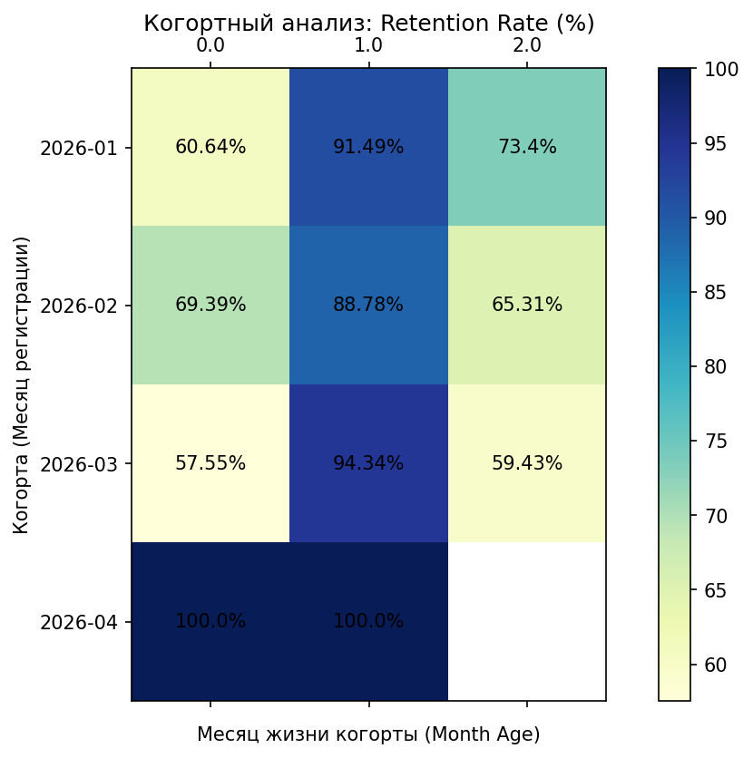

# Marketplace Analytics DWH Project

Аналитическое хранилище данных (Data Warehouse) для интернет-магазина. Проект симулирует работу маркетплейса, генерирует транзакционные данные и рассчитывает сложные бизнес-метрики на уровне СУБД.

## Технологический стек
* Инфраструктура: PostgreSQL 15 (Docker), Python 3.13 (Изолированное окружение .venv)
* Библиотеки: SQLAlchemy, Pandas, Matplotlib, pg8000
* Базы данных и SQL: Схема "Звезда" (Star Schema), Оконные функции (OVER, PARTITION BY, ROWS BETWEEN), Обобщенные табличные выражения (WITH / CTE), Функции усечения и форматирования дат (DATE_TRUNC, TO_CHAR).

## Структура репозитория
* sql/abc_analysis.sql — SQL-скрипт ABC-анализа. Классифицирует товары на категории A, B и C на основе накопительного итога выручки.
* sql/retention.sql — SQL-скрипт Когортного анализа. Рассчитывает матрицу ежемесячного удержания пользователей (Retention Rate).
* scripts/db_init.py — Инициализация структуры DWH (таблицы users, products, orders) и bulk-генерация связанных синтетических данных.
* scripts/run_analytics.py — Скрипт-оркестратор. Автоматически считывает SQL-файлы, выполняет запросы в PostgreSQL, обрабатывает результаты через Pandas, логирует шаги и сохраняет артефакты.

## Реализованная бизнес-логика

### 1. ABC-анализ товаров (Выручка)
Запрос рассчитывает долю каждого товара в общей прибыли компании с помощью кумулятивной суммы. Результаты делятся на три класса:
* Класс A: ~20% самых ходовых товаров, приносящих первые 80% выручки.
* Класс B: Средние товары, приносящие следующие 15% выручки.
* Класс C: Малоценные или редкие товары, приносящие оставшиеся 5% выручки.
Итоговый отчет сохраняется автоматически в файл abc_result.csv.

### 2. Когортный анализ (Retention Rate)
Пользователи группируются в когорты по месяцу их регистрации. Запрос отслеживает их транзакционную активность в течение следующих месяцев жизни когорты, высчитывая точный процент возвращаемости. 

Результат визуализируется в виде тепловой карты:

### 3. Промышленное логирование (pipeline.log)
В проект внедрен стандарт мониторинга logging. Пайплайн поминутно записывает стадии своей работы, количество обработанных строк и автоматически дампит трейсы (Traceback) в файл в случае падения базы данных или синтаксических ошибок.

## Инструкция по локальному запуску

1. Клонировать репозиторий:
   git clone <ссылка_на_твой_репозиторий>
   cd marketplace-sql-project

2. Поднять базу данных PostgreSQL в фоновом режиме:
   docker-compose up -d

3. Активировать виртуальное окружение и установить зависимости:
   .venv\Scripts\Activate.ps1
   pip install -r requirements.txt

4. Запустить генерацию данных и создание таблиц:
   .venv\Scripts\python.exe scripts/db_init.py

5. Запустить расчет аналитических модулей (ABC и Retention):
   .venv\Scripts\python.exe scripts/run_analytics.py
